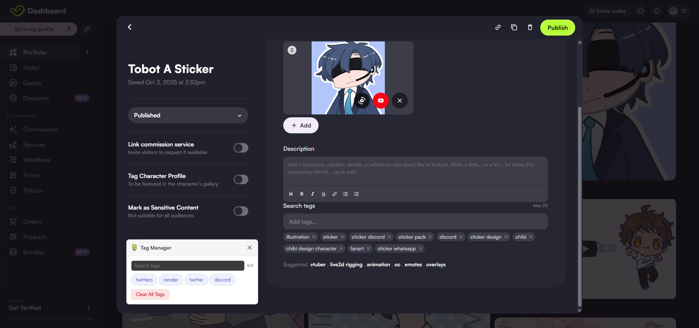

# VGen Portfolio Tag Manager

A lightweight Chrome Extension that lets you **save, manage, and quickly
re-use tags** on the [VGen portfolio
page](https://vgen.co/creator/portfolio).

It provides a draggable **Tag Manager box** with search, quick tag
insertion, and clear functionality.

------------------------------------------------------------------------

## ✨ Features

-   📌 Save tags automatically when you add them to your portfolio\
-   🔍 Search through your saved tags instantly\
-   🖱️ Click a tag to auto-fill the VGen input field\
-   🗑️ Clear all saved tags (with confirmation)\
-   🎨 Simple, draggable UI with extension icon

------------------------------------------------------------------------

## 📦 How to Install

### Option 1: Install from Source

1.  Download this repository as a ZIP or clone it:

    ``` bash
    git clone https://github.com/your-username/vgen-portfolio-tag-manager.git
    ```

2.  Open Chrome and go to `chrome://extensions/`\

3.  Enable **Developer Mode** (toggle in the top right corner)\

4.  Click **Load unpacked** and select the project folder\

5.  The extension should now appear in your toolbar 🎉

### Option 2: Install from Release (if available)

1.  Go to the **Releases** page on this repo\
2.  Download the latest `.zip` or `.crx` build\
3.  Drag and drop it into `chrome://extensions/`

------------------------------------------------------------------------

## 🖼️ Screenshots




------------------------------------------------------------------------

## ⚙️ Usage

1.  Open your [VGen portfolio page](https://vgen.co/creator/portfolio)\
2.  Click a **portfolio listing container** or the **page heading
    button** to open the Tag Manager\
3.  Use the **search bar** to filter tags\
4.  Click a tag to insert it into the VGen input field\
5.  Use **Clear All Tags** if you want to reset everything

------------------------------------------------------------------------

## ⚠️ Note

Since this extension is still new, there is a small limitation:

👉 After selecting a tag from the Tag Manager, the **"Add tags" input
field** on VGen may not immediately work.\
To make it functional again, you need to either:\
- Press **Backspace once**, or\
- Type and then remove a letter

This will refresh the input and allow it to work as expected.

------------------------------------------------------------------------

## 📂 Project Structure

    📦 vgen-portfolio-tag-manager
     ┣ 📜 manifest.json   # Extension config
     ┣ 📜 content.js      # Main logic
     ┣ 📜 icon16.png      # Toolbar icon
     ┣ 📜 icon48.png      # Popup/header icon
     ┣ 📜 icon128.png     # Store icon
     ┗ 📜 README.md

------------------------------------------------------------------------

## 🎯 Next Milestones

-   Add ability to **clear specific tags** (instead of clearing all at
    once)\
-   Fix input field issue after tag selection (no more backspace
    workaround needed)\
-   General stability and UI improvements

------------------------------------------------------------------------

## 📜 License

MIT License © 2025 Yuzuki Kouta
